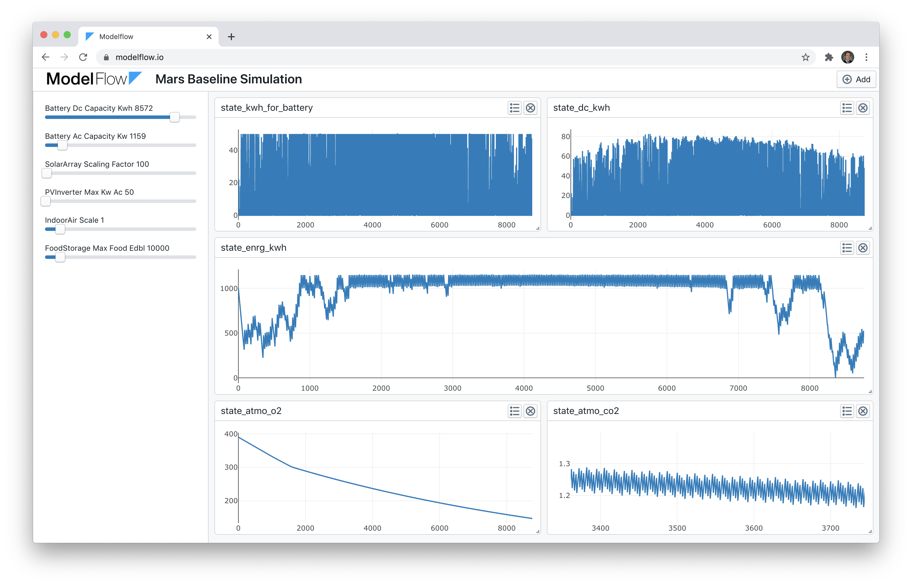

[](https://travis-ci.org/ModelFlow/modelflow)

# ModelFlow
Python framework and web interface for creating and sharing agent based models.


*Simple Mars Base Example Results Visualized in Experimental Modelflow Interface https://modelflow.io*

## Installation
Requires python 3.6 or later
```
cd ..
python3 -m venv venv
source venv/bin/activate
cd modelflow
pip install -r requirements.txt
```

## Running an example in terminal
To run the Mars baseline example:
```
cd examples/mars
python main.py --scenario baseline
```

## Running in website locally
(This currently is hard coded for the Mars example) In one terminal window after installing [npm](https://nodejs.org/en/) run:
```
cd website/frontend
npm install
npm start
```
In a second terminal window after following steps under installation, run:
```
cd website/backend
python app.py
```
In a browser open http://localhost:3000


## Testing
To run tests (from the modelflow root dir):
```
pytest
```

## Model Performance
Pure Python is extremely slow with some basic examples taking roughly 0.5 seconds for a single run. Therefore, Modelflow supports using [Numba](https://numba.pydata.org/) to automatically convert all the models to C which can lead to a *100x speed up*. This does come with a tradeoff of complexity and certain limitations on what you can do inside model run functions. Currently all models are combined into a single function in a temporary file called `generated.py` allowing Numba to convert it to C. This process takes 3-4 seconds, but subsequent calls take from 0.1 to 0.0008 seconds depending on how you measure. This speed is important if you are trying to sweep across many parameterizations. 

## Inspiration
- Wolfram Alpha System Modeler: https://www.wolfram.com/system-modeler/examples/energy/energy-consumption-model.html
- SIMOC (Mars Habitat Simulation): https://ngs.simoc.space/entry

## Notes
See [NOTES.md](NOTES.md) for TODOs and ideas

