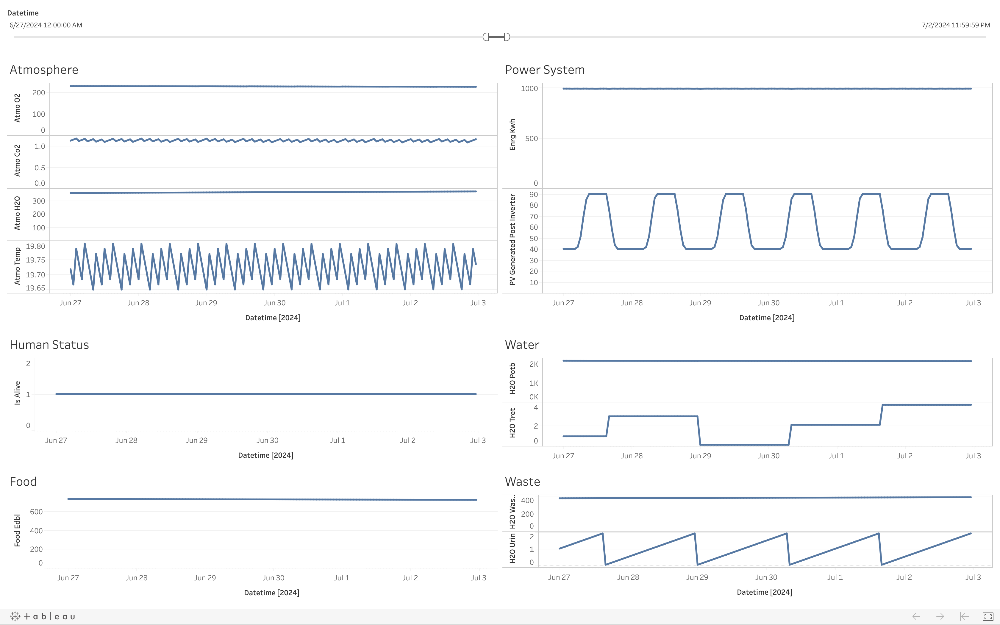

[](https://travis-ci.org/ModelFlow/modelflow)

# ModelFlow
Framework and UI for arbitrary agent based models


*Simple Mars Base Example Results Visualized in Tableau https://public.tableau.com/profile/adam.raudonis#!/vizhome/MarsBaseBaselineScenario/Dashboard*

# Installation
Please use python 3.6 or later
```
cd ..
python3 -m venv venv
source venv/bin/activate
cd modelflow
pip install -r requirements.txt
```

# Running an Example
To run Mars example:
```
cd examples/mars
python main.py --scenario baseline
```

# Example Testing
To run tests:
```
pytest
```
Note: You need to run this from the modelflow root, not cd into examples

# TODO
- Figure out how to elegantly store modeling scenarios (started serializing confits)
- See if we need to store the delta outputs from each agent
- Add PEP8 linting requirement git hook
- Support hierarchy and containers for models
- Come up with format for serializing scenario configs and agents
- Validate all serialized inputs through jsonschema
- Audit the flow of all units throughout model
- Support different time spans (not just 1hr hard coded)
- Add support for scaling models in scenarios
- Create local website that automatically documents parameters
- Create png graphical visualization of flows
- Add utility for easily running parameter sweeps
- Create local website to automatically edit parameters
- Create local website to visualize flows and potentially edit
- Look into cython for agents and optimizing speed
- Figure out a way to have certain inputs scaled on other inputs. i.e. lighting determined by habitat volume. Scale atmosphere by volume.
- Add warnings and events
- Add perhaps native support for descrete event simulation
- Add type hints to all functions
- Make it easy to be able to swap models
- Think about whether we want formal support for setting initial values
- Add documentation to all public modelflow methods

# Ideas
- Replace complicated agents with neural networks trained on parameter sweeps
- Create a playground for reinforcement learning algorithms to explore
- Think about centralized control vs decentralized control

# Performance Optimization Agent Constraints
- No f formatted strings
- No inner functions
- No subclassing agents (yet)
- Custom imports not currently handled


# Notes:
- Create a simulation platform that is fast enough that it can efficiently work with networks
- Do we treat simulation as simply a loss function which tells us whether the initial parameters / model scaling was correct. If we actually need independent agents then does this destroy the speed benefits of the code gen? We can just have a for loop for each model and then the scale can be changed. Note: We can have a mode where outputs are saved and then a mode where just constraints are checked. We can have early fails for bad scenarios.

https://github.com/paulknysh/blackbox
https://github.com/paulknysh/blackbox/blob/master/blackbox.py
https://arxiv.org/pdf/1605.00998.pdf

Questions:
- Find the optimal set and scale of objects that maximizes chance of survival

Inputs:
-max mass
-max vol
- people
- every_object scale

Outputs:
- all params
- all scales
